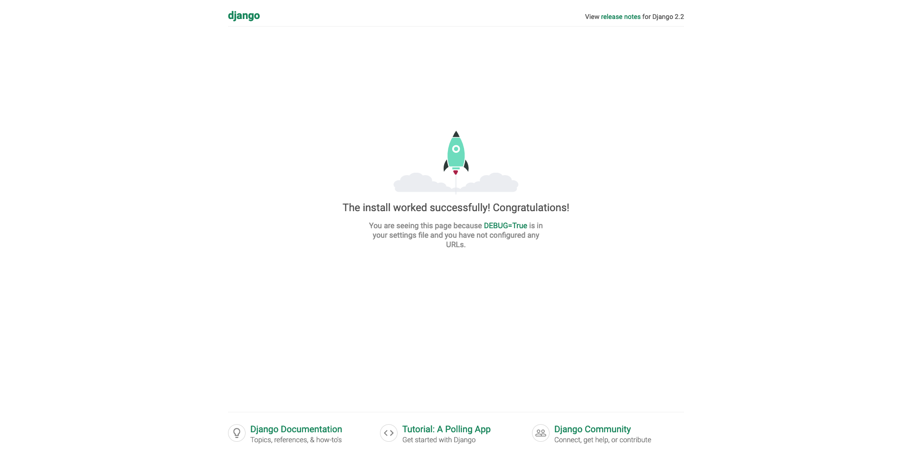

# Django Tutorial

- [さぁ始めましょう | Django ドキュメント | Django](https://docs.djangoproject.com/ja/2.2/intro/)
- [WebFrameworks - Python Wiki](https://wiki.python.org/moin/WebFrameworks)
  - Python Webフレームワークの比較。

## Part 1

- [はじめての Django アプリ作成、その 1 | Django ドキュメント | Django](https://docs.djangoproject.com/ja/2.2/intro/tutorial01/)

```bash
$ python -m django --version
2.2.2
```

サーバーを起動

```sh
$ django-admin startproject mysite
$ cd mysite
$ python manage.py runserver
...
```

これで <http://127.0.0.1:8000/> に立つ。



サーバーの IP, port を指定するには

```sh
$ python manage.py runserver 0:8000
...
```

のようにする。

### polls (投票) application

```sh
python manage.py startapp polls
```

以下を編集。

- [mysite/polls/urls.py](mysite/polls/urls.py)
- [mysite/mysite/urls.py](mysite/mysite/urls.py)

```sh
python manage.py runserver
```

して <http://127.0.0.1:8000/polls> にアクセス。

## Part 2

- [はじめての Django アプリ作成、その2 | Django ドキュメント | Django](https://docs.djangoproject.com/ja/2.2/intro/tutorial02/)

### データベース導入

```sh
python manage.py migrate
```

`db.sqlite3` が作られる。

- [mysite/polls/models.py](mysite/polls/models.py)
- [mysite/mysite/settings.py](mysite/mysite/settings.py)

を編集。

```sh
python manage.py makemigrations polls
```

```sh
python manage.py sqlmigrate polls 0001
```

```sh
python manage.py migrate
```

### API

```sh
python manage.py shell
```

で対話シェルで遊べる。

[mysite/polls/models.py](mysite/polls/models.py) の `__str__` を編集して見やすくする。

### admin user

作成。

```sh
python manage.py createsuperuser
```

立ち上げ。

```sh
python manage.py runserver
```

<http://127.0.0.1:8000/admin/> にアクセス。これだけでグループ、ユーザーの追加、削除が GUI からできるようになっている！

poll アプリを admin ページに追加。

[mysite/polls/admin.py](mysite/polls/admin.py)

を編集。adminページを更新すると question の編集ができるようになっている。
